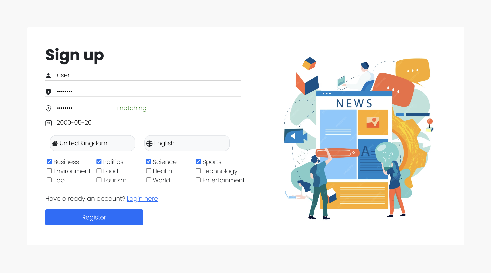

<!-- Improved compatibility of back to top link: See: https://github.com/othneildrew/Best-README-Template/pull/73 -->

<a name="readme-top"></a>
<!--
*** Thanks for checking out the Best-README-Template. If you have a suggestion
*** that would make this better, please fork the repo and create a pull request
*** or simply open an issue with the tag "enhancement".
*** Don't forget to give the project a star!
*** Thanks again! Now go create something AMAZING! :D
-->


<!-- PROJECT SHIELDS -->
<!--
*** I'm using markdown "reference style" links for readability.
*** Reference links are enclosed in brackets [ ] instead of parentheses ( ).
*** See the bottom of this document for the declaration of the reference variables
*** for contributors-url, forks-url, etc. This is an optional, concise syntax you may use.
*** https://www.markdownguide.org/basic-syntax/#reference-style-links
-->


<!-- PROJECT LOGO -->
<br />
<div align="center">
  <a href="https://github.com/github_username/repo_name">
    
  </a>

<h3 align="center">News Dealer</h3>

  <p align="center">
    A web application that customizes news according to your preferences.
  </p>
</div>


<!-- TABLE OF CONTENTS -->
<details>
  <summary>Table of Contents</summary>
  <ol>
    <li>
      <a href="#about-the-project">About The Project</a>
      <ul>
        <li><a href="#built-with">Built With</a></li>
      </ul>
    </li>
    <li>
      <a href="#getting-started">Getting Started</a>
      <ul>
        <li><a href="#prerequisites">Prerequisites</a></li>
        <li><a href="#installation">Installation</a></li>
      </ul>
    </li>
    <li><a href="#usage">Usage</a></li>
    <li><a href="#roadmap">Features</a></li>
    <li><a href="#contact">Contact</a></li>
  </ol>
</details>


<!-- ABOUT THE PROJECT -->
## About The Project

![Product Name Screen Shot][product-screenshot]

This web application is developed for people which love to read news, but do not appreciate distraction like advertisement, non-relevant topics and too many information. You can sign up for the first time, select interested topics and read news only interested to you.

<p align="right">(<a href="#readme-top">back to top</a>)</p>


### Built With

* [![Java][Java.com]][Java-url]
* [![Spring][Spring.io]][Spring-url]
* [![Thymeleaf][Thymeleaf.org]][Thymeleaf-url]
* [![Postgresql][Postgresql.org]][Postgresql-url]
* [![Bootstrap][Bootstrap.com]][Bootstrap-url]
* [![Javascript][Javascript.com]][Javascript-url]
* [![JQuery][JQuery.com]][JQuery-url]

<p align="right">(<a href="#readme-top">back to top</a>)</p>


<!-- GETTING STARTED -->
## Getting Started

This project is creating for trainings objectives, that's why it can be used only if you start server on your local computer.

### Prerequisites

Install PostgreSQL on your computer: https://www.postgresql.org and create a database

### Installation

1. Get a free API Key at https://newsdata.io/documentation/#get-newdata-api-key
2. Clone the repo
   ```sh
   git clone https://github.com/kiiril/NewsAggregator
   ```
3. Copy code from `sql_code` and paste to your query console
4. In `application.properties.origin` insert database url, your username and password. RENAME file to `application.properties`
   ```sh
   spring.datasource.url=
   spring.datasource.username=
   spring.datasource.password=
   ```
5. Enter your API in `/services/NewsGeneratorService`
   ```java
   public static final API_KEY = 'ENTER YOUR API';
   ```
6. You can start the server and access the main page with URL: http://localhost:8080/main

<p align="right">(<a href="#readme-top">back to top</a>)</p>


<!-- USAGE EXAMPLES -->
## Usage


<div style="display: flex; justify-content: space-around;">

  <div style="flex: 0 0 48%;">
    
  </div>

  <div style="flex: 0 0 48%;">
    
  </div>

</div>

<div style="display: flex; justify-content: space-around;">

  <div style="flex: 0 0 48%;">
    
  </div>

  <div style="flex: 0 0 48%;">
    
  </div>

</div>


<p align="right">(<a href="#readme-top">back to top</a>)</p>


## Features
Will be added soon...
- [ ] Registration
- [ ] Authentication
- [ ] Editing profile
- [ ] Searching news by keywords
- [ ] Filtering news

<p align="right">(<a href="#readme-top">back to top</a>)</p>  


<!-- CONTACT -->
## Contact

kirylbuloichyk@gmail.com

<p align="right">(<a href="#readme-top">back to top</a>)</p>


<!-- MARKDOWN LINKS & IMAGES -->
<!-- https://www.markdownguide.org/basic-syntax/#reference-style-links -->
[contributors-shield]: https://img.shields.io/github/contributors/github_username/repo_name.svg?style=for-the-badge
[contributors-url]: https://github.com/github_username/repo_name/graphs/contributors
[forks-shield]: https://img.shields.io/github/forks/github_username/repo_name.svg?style=for-the-badge
[forks-url]: https://github.com/github_username/repo_name/network/members
[stars-shield]: https://img.shields.io/github/stars/github_username/repo_name.svg?style=for-the-badge
[stars-url]: https://github.com/github_username/repo_name/stargazers
[issues-shield]: https://img.shields.io/github/issues/github_username/repo_name.svg?style=for-the-badge
[issues-url]: https://github.com/github_username/repo_name/issues
[license-shield]: https://img.shields.io/github/license/github_username/repo_name.svg?style=for-the-badge
[license-url]: https://github.com/github_username/repo_name/blob/master/LICENSE.txt
[linkedin-shield]: https://img.shields.io/badge/-LinkedIn-black.svg?style=for-the-badge&logo=linkedin&colorB=555
[linkedin-url]: https://linkedin.com/in/linkedin_username
[product-screenshot]: demos/demo-main.png
[Next.js]: https://img.shields.io/badge/next.js-000000?style=for-the-badge&logo=nextdotjs&logoColor=white
[Next-url]: https://nextjs.org/
[React.js]: https://img.shields.io/badge/React-20232A?style=for-the-badge&logo=react&logoColor=61DAFB
[React-url]: https://reactjs.org/
[Vue.js]: https://img.shields.io/badge/Vue.js-35495E?style=for-the-badge&logo=vuedotjs&logoColor=4FC08D
[Vue-url]: https://vuejs.org/
[Angular.io]: https://img.shields.io/badge/Angular-DD0031?style=for-the-badge&logo=angular&logoColor=white
[Angular-url]: https://angular.io/
[Svelte.dev]: https://img.shields.io/badge/Svelte-4A4A55?style=for-the-badge&logo=svelte&logoColor=FF3E00
[Svelte-url]: https://svelte.dev/
[Laravel.com]: https://img.shields.io/badge/Laravel-FF2D20?style=for-the-badge&logo=laravel&logoColor=white
[Laravel-url]: https://laravel.com
[Bootstrap.com]: https://img.shields.io/badge/Bootstrap-563D7C?style=for-the-badge&logo=bootstrap&logoColor=white
[Bootstrap-url]: https://getbootstrap.com
[JQuery.com]: https://img.shields.io/badge/jQuery-0769AD?style=for-the-badge&logo=jquery&logoColor=white
[JQuery-url]: https://jquery.com 

[Java.com]: https://img.shields.io/badge/java-%23ED8B00.svg?style=for-the-badge&logo=openjdk&logoColor=white
[Java-url]: https://www.java.com/
[Spring.io]: https://img.shields.io/badge/spring-%236DB33F.svg?style=for-the-badge&logo=spring&logoColor=white
[Spring-url]: https://spring.io
[Thymeleaf.org]: https://img.shields.io/badge/Thymeleaf-%23005C0F.svg?style=for-the-badge&logo=Thymeleaf&logoColor=white
[Thymeleaf-url]: https://www.thymeleaf.org
[Postgresql.org]: https://img.shields.io/badge/postgres-%23316192.svg?style=for-the-badge&logo=postgresql&logoColor=white
[Postgresql-url]: https://www.postgresql.org
[Javascript.com]: https://img.shields.io/badge/javascript-%23323330.svg?style=for-the-badge&logo=javascript&logoColor=%23F7DF1E
[Javascript-url]: https://www.javascript.com
